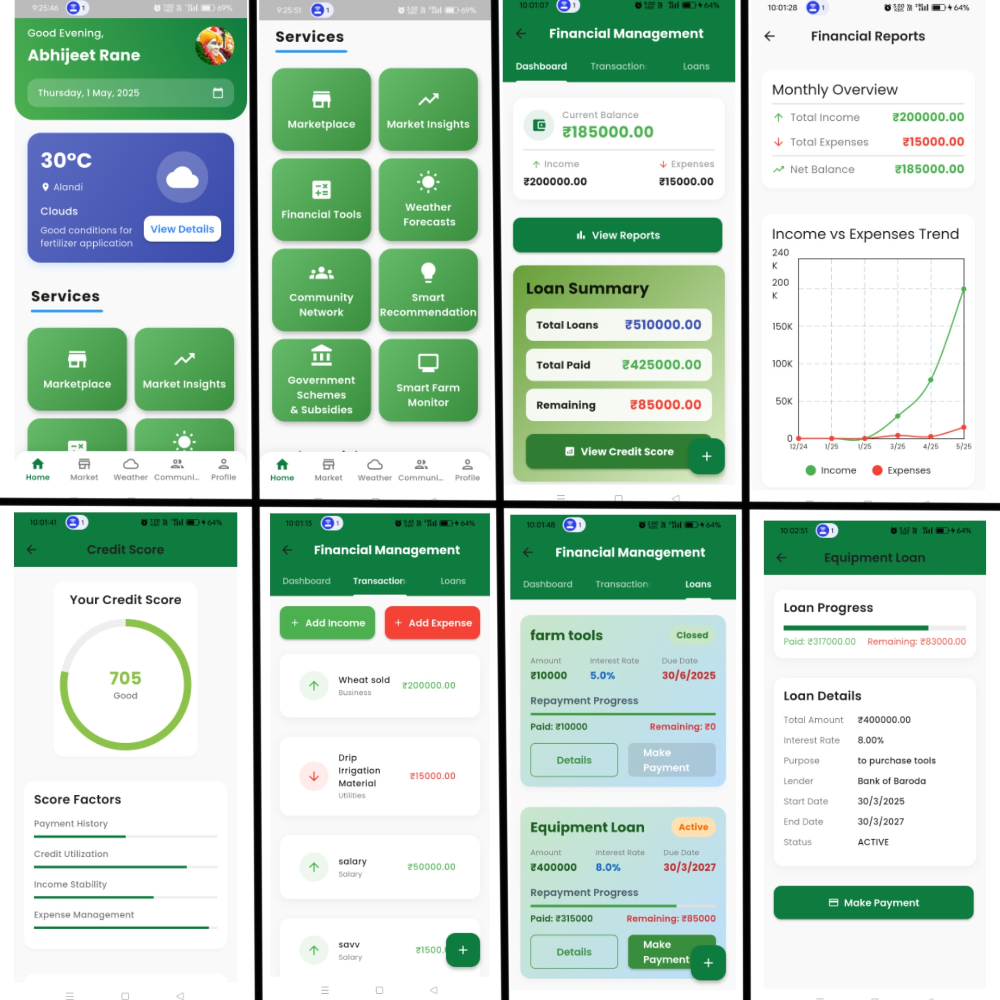
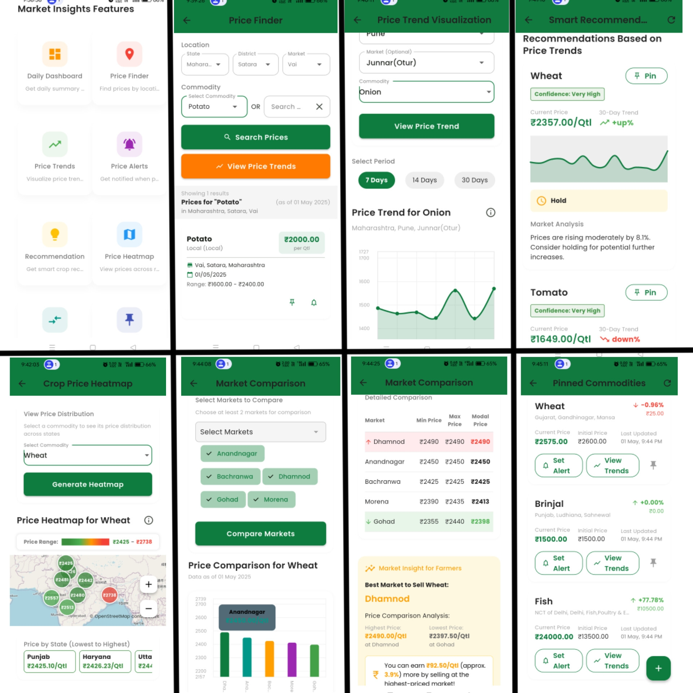
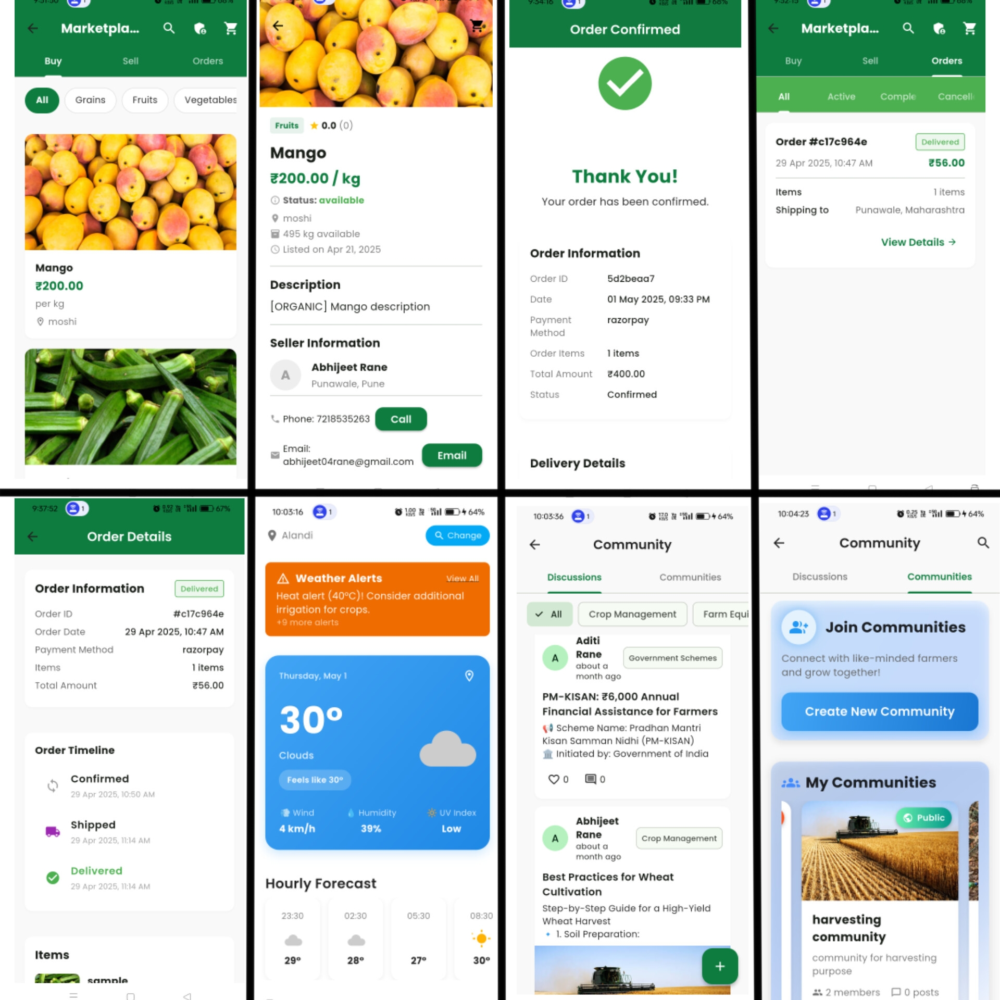
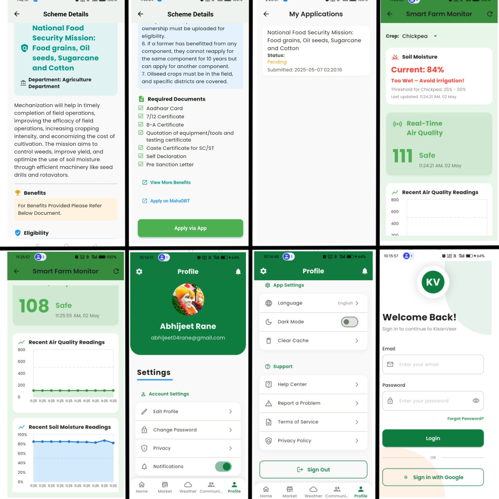

<div align="center">

# 🌾 KisanVeer

**Empowering Indian Farmers with Technology**

A comprehensive Flutter mobile application that connects farmers to markets, weather insights, financial tools, e-commerce, and community — all in one platform.

[](https://flutter.dev)
[](https://dart.dev)
[](https://supabase.com)
[](LICENSE)
[](https://github.com/abhijeet-rane/KisanVeer-App/releases/latest)

</div>

---

## 📱 Features

### 📊 Market Insights & Analytics
- **Daily Dashboard** — Top commodities, price volatility, arrivals by state
- **Price Trends** — Historical charts over 7/14/30 days
- **Price Finder** — Search by state, district, market
- **Market Comparison** — Compare prices across markets
- **Crop Price Heatmap** — Interactive geographic price visualization
- **Smart Recommendations** — AI-driven buy/sell/hold suggestions with confidence scores

### 🛒 Marketplace & E-Commerce
- Product listing, cart, checkout, order tracking
- Seller admin panel for managing products & orders

### 🌤️ Weather & Crop Advisory
- Detailed forecasts (hourly/daily) with weather alerts
- Context-aware crop recommendations based on region, season, and weather
- Maharashtra-specific crop advice with growth stages

### 💰 Financial Management
- Agricultural loan management (apply, track, pay via Razorpay)
- Transaction history, credit score, financial reports

### 👥 Community & Social
- Farming communities, forums, posts & comments
- Content moderation and privacy controls

### 🏛️ Government Schemes
- Browse, filter, and apply for relevant government schemes

### 🔒 Security & Enterprise Features
- **Biometric Authentication** — Fingerprint/Face ID login
- **Secure Storage** — AES-256 encrypted token storage
- **Offline Mode** — Works without internet, syncs when back online
- **Analytics & Performance Monitoring** — Event tracking and screen load metrics
- **Structured Logging** — Enterprise-grade logging with levels

---

## 🏗️ Tech Stack

| Layer | Technology |
|---|---|
| **Framework** | Flutter 3.x / Dart 3.x |
| **Backend** | Supabase (Auth, Database, Storage) |
| **Database** | PostgreSQL (via Supabase) with RLS |
| **Payments** | Razorpay |
| **Maps** | Google Maps, Flutter Map |
| **Auth** | Supabase Auth + Biometric (local_auth) |
| **Storage** | Hive (offline), Flutter Secure Storage |
| **State** | Provider |

---

## 📂 Project Structure

```
lib/
├── main.dart                  # App entry point
├── constants/                 # Colors, text styles, theme, constants
├── models/                    # Data models (user, market, product, etc.)
├── screens/                   # UI screens organized by feature
│   ├── auth/                  # Login, register
│   ├── home/                  # Main screen, home
│   ├── market/                # Market insights, trends, heatmap
│   ├── marketplace/           # E-commerce, cart, orders
│   ├── community/             # Forums, posts
│   ├── weather/               # Weather dashboard
│   ├── finance/               # Loans, transactions
│   ├── schemes/               # Government schemes
│   ├── profile/               # User profile, settings
│   └── ...
├── services/                  # Business logic & API services
│   ├── auth_service.dart      # Authentication
│   ├── biometric_service.dart # Biometric login
│   ├── market_service.dart    # Market data
│   ├── weather_service.dart   # Weather API
│   ├── sync_manager.dart      # Offline sync
│   └── ...
├── utils/                     # Utilities (logger, network, haptics)
└── widgets/                   # Reusable UI components
db/                            # SQL schemas & migrations
assets/                        # Images, icons, fonts, animations
```

---

## 🚀 Getting Started

### Prerequisites

- [Flutter SDK](https://docs.flutter.dev/get-started/install) (3.x or later)
- Android Studio / VS Code
- A [Supabase](https://supabase.com) project

### 🔑 Security & Environment

This project uses **GitHub Actions Secrets** to securely build the application without exposing sensitive keys. To fork and build this project, add these secrets to your repository settings:

- `SUPABASE_URL`: Your Supabase Project URL
- `SUPABASE_ANON_KEY`: Your Supabase Anonymous Key

### 🛠️ Local Development Setup

1. **Clone the repository:**
   ```bash
   git clone https://github.com/abhijeet-rane/KisanVeer-App.git
   ```

2. **Configure Environment:**
   Create a `.env` file in the root directory:
   ```env
   SUPABASE_URL=your_project_url
   SUPABASE_ANON_KEY=your_anon_key
   ```

3. **Install dependencies**
   ```bash
   flutter pub get
   ```

4. **Run the app**
   ```bash
   flutter run
   ```

---

## 📸 Screenshots









---

## 🤝 Contributing

1. Fork the repository
2. Create your feature branch (`git checkout -b feature/amazing-feature`)
3. Commit your changes (`git commit -m 'Add amazing feature'`)
4. Push to the branch (`git push origin feature/amazing-feature`)
5. Open a Pull Request

---

## 📄 License

This project is licensed under the MIT License — see the [LICENSE](LICENSE) file for details.

---

<div align="center">

**Built with ❤️ for Indian Farmers**

</div>
