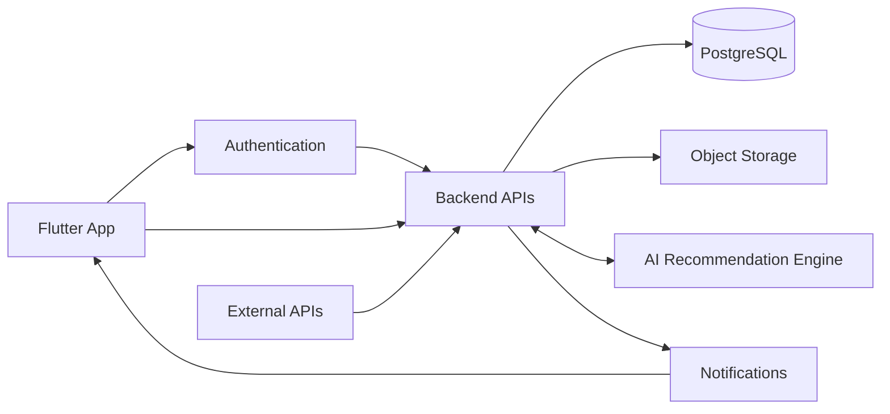
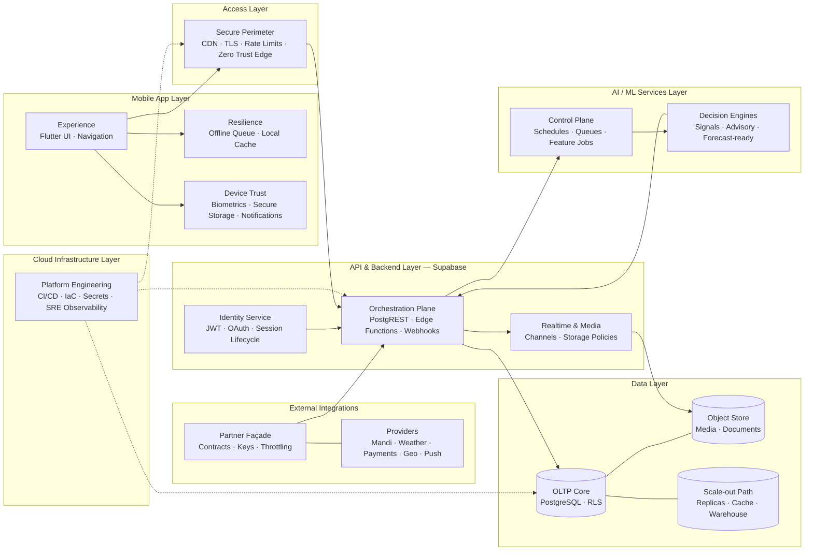
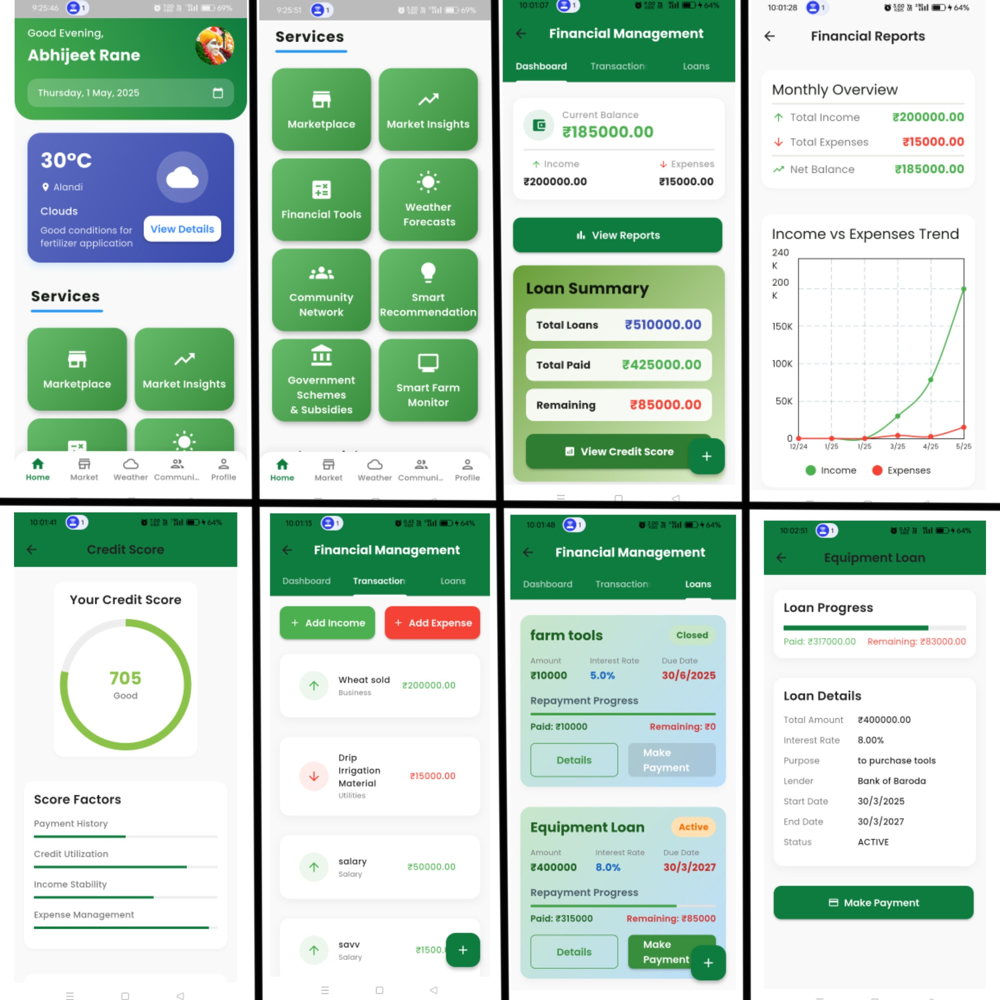
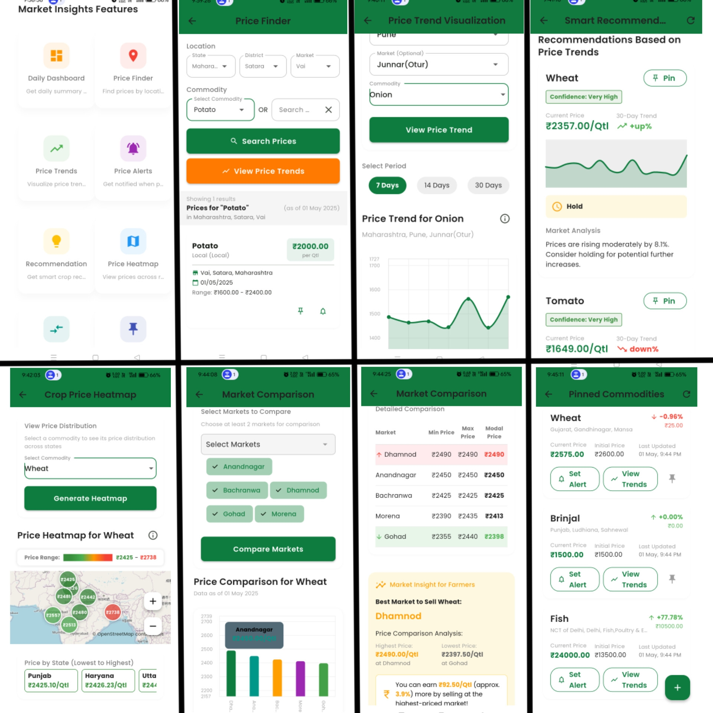
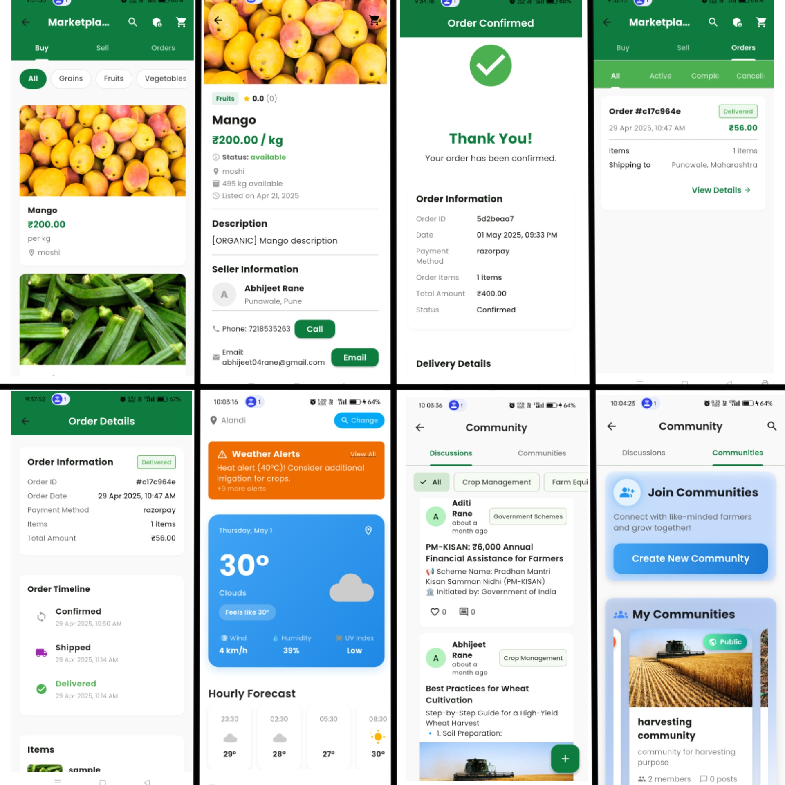
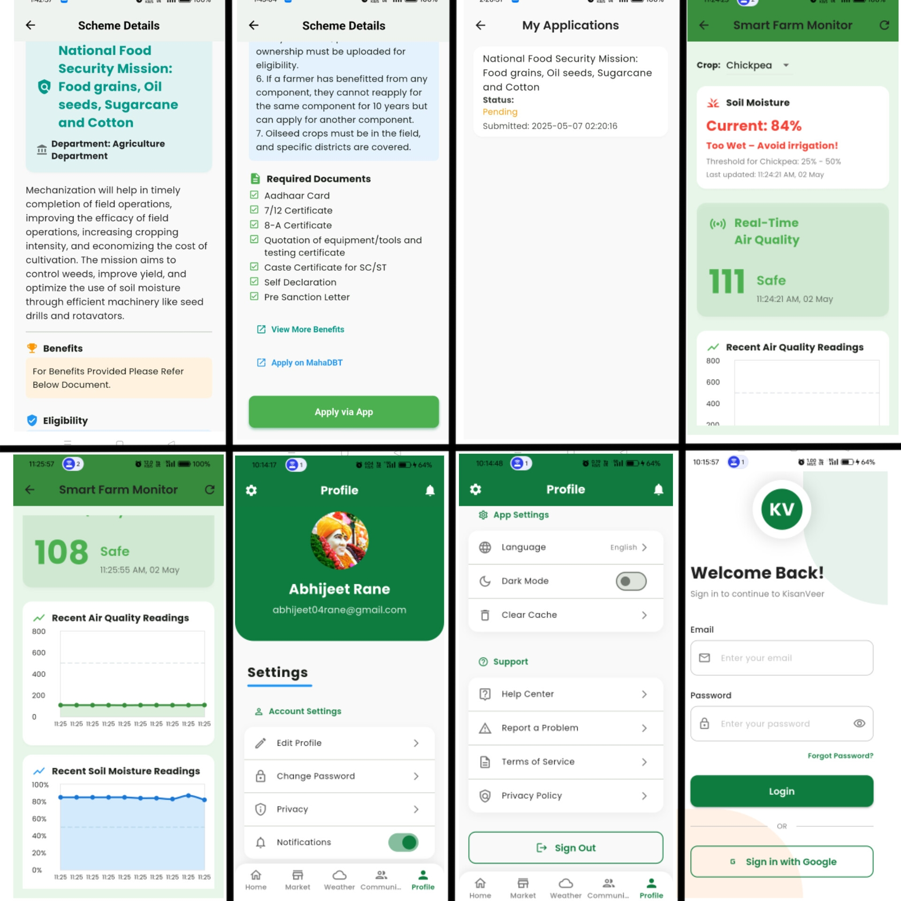

<div align="center">

# KisanVeer

**Cloud-native AgriTech platform connecting farmers to markets, intelligence, and community.**

[](https://flutter.dev)
[](https://dart.dev)
[](https://supabase.com)
[](LICENSE)
[](https://github.com/abhijeet-rane/KisanVeer-App/releases/latest)

</div>

---

KisanVeer is a **production-oriented Flutter client** on top of a **Supabase-backed** stack: PostgreSQL, authentication, object storage, and optional edge compute. The product bundles **mandi-grade analytics**, **weather-aware advisory**, **intelligent crop signals**, **commerce**, **community**, and **financial workflows** into a single mobile experience—with **offline-first** behavior and **security-first** session handling.

This repository is optimized for **Android** releases; other platforms can be enabled from the same Flutter codebase where desired.

---

## Key capabilities

| Domain | What you get |
|--------|----------------|
| **Intelligent crop signals** | Trend- and volatility-aware buy / sell / hold / watch guidance with confidence-style scoring, grounded in historical mandi prices and user crop preferences. |
| **Mandi price analytics** | Daily dashboards, comparisons, heatmaps, historical windows, and search by geography—fed from government open data APIs. |
| **Weather insights** | Current conditions, forecasts, caching, and context for crop advisory; optional persistence of weather snapshots per user. |
| **Offline-first** | Local queues, Hive-backed storage, and sync when connectivity returns—reducing field usability friction. |
| **Secure access** | Supabase Auth (email/password, Google OAuth), JWT-backed API access, optional biometric unlock with refresh-token discipline. |
| **Notifications** | Local notification flows for weather and product engagement patterns (extensible to full push infrastructure). |
| **Marketplace & community** | Listings, cart/checkout, seller tooling, orders, forums/communities, schemes, and related admin flows. |

---

## High-level architecture

End-to-end data flow from the device through Supabase to external providers.


```mermaid
graph LR
  App[Flutter App]
  Auth[Authentication]
  API[Backend APIs]
  AI[AI Recommendation Engine]
  DB[(PostgreSQL)]
  Store[Object Storage]
  Ext[External APIs]
  Notify[Notifications]

  App --> Auth
  Auth --> API
  App --> API
  API --> DB
  API --> Store
  API <--> AI
  Ext --> API
  API --> Notify
  Notify --> App
```

---

## Production system architecture

Reference model for how KisanVeer scales as a **cloud-native AgriTech** product: clear perimeter, Supabase as the control plane, intelligence as a first-class layer, and a data tier that can grow toward replicas, caching, and analytics warehouses.


```mermaid
graph LR
  subgraph MOB["Mobile App Layer"]
    direction TB
    MOB_APP["Experience<br/>Flutter UI · Navigation"]
    MOB_RES["Resilience<br/>Offline Queue · Local Cache"]
    MOB_TRUST["Device Trust<br/>Biometrics · Secure Storage · Notifications"]
    MOB_APP --> MOB_RES
    MOB_APP --> MOB_TRUST
  end

  subgraph EDGE["Access Layer"]
    direction TB
    EDGE_SEC["Secure Perimeter<br/>CDN · TLS · Rate Limits · Zero Trust Edge"]
  end

  subgraph EXT["External Integrations"]
    direction TB
    EXT_FAC["Partner Façade<br/>Contracts · Keys · Throttling"]
    EXT_PROV["Providers<br/>Mandi · Weather · Payments · Geo · Push"]
    EXT_FAC --- EXT_PROV
  end

  subgraph BACK["API & Backend Layer — Supabase"]
    direction TB
    BACK_ID["Identity Service<br/>JWT · OAuth · Session Lifecycle"]
    BACK_ORCH["Orchestration Plane<br/>PostgREST · Edge Functions · Webhooks"]
    BACK_EVT["Realtime & Media<br/>Channels · Storage Policies"]
    BACK_ID --> BACK_ORCH
    BACK_ORCH --> BACK_EVT
  end

  subgraph AIML["AI / ML Services Layer"]
    direction TB
    AIML_CTRL["Control Plane<br/>Schedules · Queues · Feature Jobs"]
    AIML_ENG["Decision Engines<br/>Signals · Advisory · Forecast-ready"]
    AIML_CTRL --> AIML_ENG
  end

  subgraph DATA["Data Layer"]
    direction TB
    DATA_OLTP[("OLTP Core<br/>PostgreSQL · RLS")]
    DATA_MEDIA[("Object Store<br/>Media · Documents")]
    DATA_SCALE[("Scale-out Path<br/>Replicas · Cache · Warehouse")]
    DATA_OLTP --- DATA_MEDIA
    DATA_OLTP --- DATA_SCALE
  end

  subgraph CLOUD["Cloud Infrastructure Layer"]
    direction TB
    CLOUD_OPS["Platform Engineering<br/>CI/CD · IaC · Secrets · SRE Observability"]
  end

  MOB_APP --> EDGE_SEC
  EDGE_SEC --> BACK_ORCH
  EXT_FAC --> BACK_ORCH

  BACK_ORCH --> DATA_OLTP
  BACK_EVT --> DATA_MEDIA

  BACK_ORCH --> AIML_CTRL
  AIML_ENG --> BACK_ORCH

  CLOUD_OPS -.-> EDGE_SEC
  CLOUD_OPS -.-> BACK_ORCH
  CLOUD_OPS -.-> DATA_OLTP
```

---

## AI crop forecasting & recommendation pipeline

The **intelligent recommendation surface** is designed as an AgriTech signal pipeline—today implemented as a **fast, explainable trend engine** in the client and service layer, with a clear path to heavier ML in production.

1. **Ingest** — Mandi price records are retrieved from **government open-data APIs** (API keys are resolved via Supabase configuration patterns).
2. **Feature windows** — Historical slices (e.g., multi-day trends) and volatility cues are computed per commodity, market, and geography.
3. **Signal synthesis** — Price momentum, spread, and stability heuristics map to actions such as **buy**, **sell**, **hold**, **watch**, or **stable**, with **confidence-style scoring** and human-readable reasoning.
4. **Personalization** — User **state** and **crop preferences** narrow the universe of commodities so recommendations stay relevant in the field.
5. **Delivery** — Results power dedicated UX (charts, pins, refresh flows) and can be extended to **batch recompute**, **model serving**, and **event-driven jobs** as the platform matures.

**Crop advisory** layers regional agronomy knowledge (e.g., growth stages, seasonality) with live weather context—suitable for evolving into a supervised or hybrid ML stack without changing the product narrative.

---

## Tech stack

| Layer | Technologies |
|--------|----------------|
| **Frontend** | Flutter, Dart 3.8+, Provider, Material theming, charts & motion libraries |
| **Backend** | Supabase (Auth, PostgREST, Storage, Edge Functions, Realtime-ready) |
| **Cloud** | Supabase-managed PostgreSQL, object storage buckets, Deno edge functions |
| **APIs & data feeds** | Government mandi open data, OpenWeatherMap, Razorpay payments, geolocation & geocoding |
| **AI / ML** | Trend- and rules-driven recommendation engine today; structured for batch jobs, queues, and model endpoints tomorrow |
| **DevOps** | GitHub Actions release pipeline, environment injection via CI secrets, signed Android artifacts |

---

## Security & scalability

| Theme | Approach |
|--------|----------|
| **Authentication** | Supabase-issued **JWTs**, OAuth (Google), password flows, refresh rotation with biometric-aware storage policies |
| **Authorization** | **Row Level Security** on PostgreSQL for tenant-safe access patterns (see `supabase/migrations` for representative policies) |
| **Caching** | Client-side weather caching, extensible server-side cache tier in the reference architecture |
| **Offline & sync** | Hive-backed persistence, queued mutations, connectivity-aware **sync manager** |
| **Scalable architecture** | Logical separation of **edge**, **API orchestration**, **intelligence**, and **data planes**; ready for read replicas, dedicated analytics stores, and edge-heavy traffic |
| **Observability** | Structured logging, performance tracing hooks, batched **analytics events** to PostgreSQL—expandable to OpenTelemetry and centralized SIEM |
| **Async processing** | Edge functions, background flush timers, and design space for job queues and scheduled workers |

---

## Deployment & infrastructure

| Component | Detail |
|-----------|--------|
| **Supabase** | Primary control plane: auth, database, storage, optional triggers and edge functions (`supabase/` in-repo) |
| **CI/CD** | `.github/workflows/release.yml` builds **release APKs** on tags/releases using Flutter **3.32.5** |
| **Secrets** | `SUPABASE_URL` and `SUPABASE_ANON_KEY` supplied via **GitHub Actions secrets** at build time; local `.env` for development |
| **Cloud-native posture** | TLS-terminated APIs, storage policies, and a path to multi-environment promotion (dev/stage/prod) |

---

## Project structure

| Path | Purpose |
|------|---------|
| `lib/main.dart` | Application bootstrap: environment load, Supabase init, auth listener, analytics, notifications |
| `lib/screens/` | Feature modules: auth, home, market, marketplace, weather, finance, schemes, community, profile, onboarding |
| `lib/services/` | Domain services: auth, market & history, weather & alerts, crop advice, marketplace, finance, community, schemes, sync, analytics, sensors, notifications |
| `lib/models/` | Typed domain models shared across UI and services |
| `lib/widgets/` | Reusable UI primitives and feature widgets |
| `lib/constants/` | Design system tokens (color, spacing, typography) |
| `lib/utils/` | Logging, networking, validation, accessibility helpers |
| `supabase/migrations/` | SQL migrations (e.g., community, analytics events, storage buckets) |
| `supabase/functions/` | Edge function sources (e.g., user lifecycle hooks) |
| `assets/` | Images, icons, fonts, Lottie animations, audio |
| `android/` | Android packaging, permissions, deep links for OAuth |
| `.github/workflows/` | Release automation |

> **Note:** Additional SQL or operational assets may live in your Supabase project outside this repository; treat migrations here as a **baseline**, not an exhaustive catalog of every production table.

---

## Setup

### Prerequisites

- [Flutter SDK](https://docs.flutter.dev/get-started/install) (3.x, compatible with Dart **>=3.8.0**)
- Android toolchain (this repo targets **Android** artifacts by default)
- A [Supabase](https://supabase.com) project

### Local configuration

1. **Clone**
   ```bash
   git clone https://github.com/abhijeet-rane/KisanVeer-App.git
   cd KisanVeer-App
   ```

2. **Environment** — create `.env` at the repository root:
   ```env
   SUPABASE_URL=https://your-project.supabase.co
   SUPABASE_ANON_KEY=your_anon_key
   ```

3. **Install & run**
   ```bash
   flutter pub get
   flutter run
   ```

### Fork & CI builds

Configure GitHub repository secrets:

| Secret | Purpose |
|--------|---------|
| `SUPABASE_URL` | Injected into `.env` during CI |
| `SUPABASE_ANON_KEY` | Injected into `.env` during CI |

---

## Screenshots

<p align="center">
  
  
  
  
</p>

---

## Future enhancements

- **Model serving** — Deploy managed inference (batch + online) for commodity forecasts and risk scoring.
- **Stream processing** — Ingest high-frequency mandi feeds into a dedicated analytics path with CDC.
- **Push at scale** — FCM/APNs integration with topic and geo segmentation.
- **Multi-tenant ops** — Formal environments, feature flags, and progressive rollout tooling.
- **Field telemetry** — Expand IoT/sensor ingestion with validation, alerting, and edge buffering.
- **Cross-platform releases** — Promote iOS/desktop/web builds where market fit warrants.

---

## Contributing

1. Fork the repository and create a feature branch.
2. Keep changes focused; match existing patterns for services, logging, and UI.
3. Run `flutter analyze` / tests before opening a PR.
4. Open a pull request with a clear description of user impact and risk.

---

## License

**KisanVeer** is **proprietary software**. Copyright © 2026 Abhijeet Rane. All rights reserved.

The repository may remain **publicly viewable on GitHub** for transparency and **personal, non-commercial educational reference** only. Any **commercial use**, **resale**, **redistribution**, **sublicensing**, **removal of attribution**, or **modification and further distribution** requires **prior written permission** from the copyright holder. See the full terms in **[LICENSE](LICENSE)**.

THE SOFTWARE IS PROVIDED **“AS IS”** WITHOUT WARRANTY OF ANY KIND. See **Section 9 (No Warranty)** and **Section 10 (Limitation of Liability)** in [LICENSE](LICENSE).

---

<div align="center">

**KisanVeer — market intelligence, weather context, and community in one AgriTech platform.**

</div>
